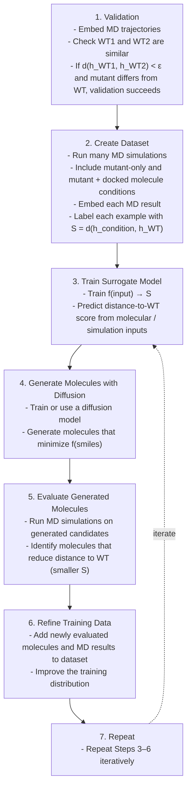

# Roadmap toward Restoring p53

```mermaid
flowchart TD
    A["1. Validation<br/>- Embed MD trajectories<br/>- Check WT1 and WT2 are similar<br/>- If d(h_WT1, h_WT2) < ε and mutant differs from WT, validation succeeds"]
    B["2. Create Dataset<br/>- Run many MD simulations<br/>- Include mutant-only and mutant + docked molecule conditions<br/>- Embed each MD result<br/>- Label each example with S = d(h_condition, h_WT)"]
    C["3. Train Surrogate Model<br/>- Train f(input) → S<br/>- Predict distance-to-WT score from molecular / simulation inputs"]
    D["4. Generate Molecules with Diffusion<br/>- Train or use a diffusion model<br/>- Generate molecules that minimize f(smiles)"]
    E["5. Evaluate Generated Molecules<br/>- Run MD simulations on generated candidates<br/>- Identify molecules that reduce distance to WT (smaller S)"]
    F["6. Refine Training Data<br/>- Add newly evaluated molecules and MD results to dataset<br/>- Improve the training distribution"]
    G["7. Repeat<br/>- Repeat Steps 3–6 iteratively"]

    A --> B --> C --> D --> E --> F --> G
    G -. iterate .-> C
```