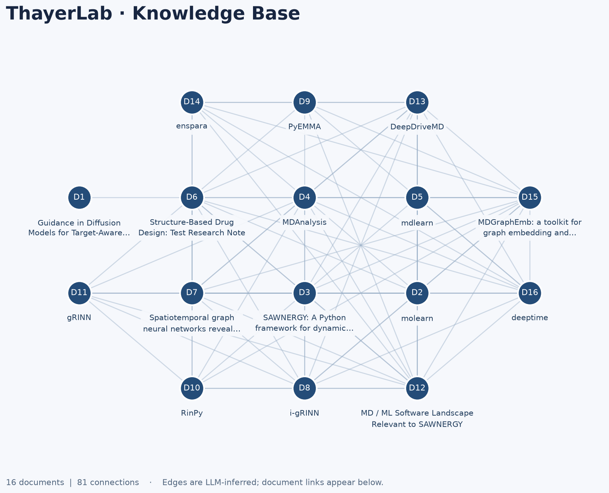

# ThayerLab Knowledge Base

A shared record of our publications, theses, methods, research notes, and relevant external literature. Use the knowledge graph to find documents and explore connections across the lab's work.

## Knowledge graph

Each node represents a submitted document. Connections are **LLM-inferred topical similarities**, not verified citations, causal relationships, or scientific conclusions. Short titles appear beneath each node; the IDs inside the circles match the full document titles and links in the table below.

<!-- KG:START -->



**16 documents · 81 LLM-inferred connections**

### Documents

| Node | Document | Original source | Keywords | Connected documents |
| --- | --- | --- | --- | --- |
| D1 | [Guidance in Diffusion Models for Target-Aware Molecular Generation](KG/node_contents/0189f29a1668f2dccc3adbd7eb3a23c6794df9c12fbe8a99a11e55a2ed4e02d9/content.md) ([summary](KG/node_contents/0189f29a1668f2dccc3adbd7eb3a23c6794df9c12fbe8a99a11e55a2ed4e02d9/metadata.json)) | [PDF](sources/0189f29a1668f2dccc3adbd7eb3a23c6794df9c12fbe8a99a11e55a2ed4e02d9/original.pdf) | diffusion models, molecular generation, target-aware generation, binding affinity, surrogate model, TargetDiff, PolyGen2D, graph neural networks, SE\(3\)-equivariance, molecular docking | [Structure-Based Drug Design: Test Research Note](KG/node_contents/1c0c3d6795f6aea9b2785bf8a8a6a9bcbfcdff45ed139372d29d82bb324b7300/content.md) |
| D2 | [molearn](KG/node_contents/032ccea09088936d97298cfd360ed651db6739c7d1296e02662939e04ac7e109/content.md) ([summary](KG/node_contents/032ccea09088936d97298cfd360ed651db6739c7d1296e02662939e04ac7e109/metadata.json)) | [MD](sources/032ccea09088936d97298cfd360ed651db6739c7d1296e02662939e04ac7e109/original.md) | molearn, protein conformational spaces, machine learning, latent representation, autoencoder, convolutional neural networks, physics-informed machine learning, OpenMM, molecular dynamics, generative modeling | [SAWNERGY: A Python framework for dynamic residue-interaction networks and walk-based embeddings from molecular dynamics simulations](KG/node_contents/0c23bcd66b19b204436d471c34cf5e8e4e0f6b374d0202aed8be6998ff4f06be/content.md), [MDAnalysis](KG/node_contents/0dfe1d7320a89f84a7eeca357972884670fb4bd8a803f51f19b640002ed72bfd/content.md), [mdlearn](KG/node_contents/15ab0cc1e3f35c7adaa783f544fa7780f8aeefc9f987080f1e7a733ba50d01da/content.md), [Structure-Based Drug Design: Test Research Note](KG/node_contents/1c0c3d6795f6aea9b2785bf8a8a6a9bcbfcdff45ed139372d29d82bb324b7300/content.md), [Spatiotemporal graph neural networks reveal conformational binding signature in protein dynamics](KG/node_contents/20ddb9cdf632136cc63dc7f0caa0b86e07c42cb6fb098a88c2c9cc5f33baeefc/content.md), [i-gRINN](KG/node_contents/40d9a47ad9f3b756b6ea1f1c8ae428ede792add3b898d34268fb98beaa189bc6/content.md), [MD / ML Software Landscape Relevant to SAWNERGY](KG/node_contents/723918af919b4a21040ad86e0193aba2cd00d299f4b0687e4d6241ff836c822d/content.md), [DeepDriveMD](KG/node_contents/ba05739ed5b10ceaec6b93c78f6bbddb88151b7e11e075067d85275b6968bf01/content.md), [MDGraphEmb: a toolkit for graph embedding and classification of protein conformational ensembles](KG/node_contents/f421dffa71e9d4f28ba2ed6e84a7480a74402e33d2a660697c728fb793eb5cfc/content.md) |
| D3 | [SAWNERGY: A Python framework for dynamic residue-interaction networks and walk-based embeddings from molecular dynamics simulations](KG/node_contents/0c23bcd66b19b204436d471c34cf5e8e4e0f6b374d0202aed8be6998ff4f06be/content.md) ([summary](KG/node_contents/0c23bcd66b19b204436d471c34cf5e8e4e0f6b374d0202aed8be6998ff4f06be/metadata.json)) | [MD](sources/0c23bcd66b19b204436d471c34cf5e8e4e0f6b374d0202aed8be6998ff4f06be/original.md) | SAWNERGY, molecular dynamics, residue interaction networks, DeepWalk, skip-gram embeddings, electrostatic interactions, van der Waals interactions, random walks, self-avoiding walks, Zarr compression | [molearn](KG/node_contents/032ccea09088936d97298cfd360ed651db6739c7d1296e02662939e04ac7e109/content.md), [MDAnalysis](KG/node_contents/0dfe1d7320a89f84a7eeca357972884670fb4bd8a803f51f19b640002ed72bfd/content.md), [mdlearn](KG/node_contents/15ab0cc1e3f35c7adaa783f544fa7780f8aeefc9f987080f1e7a733ba50d01da/content.md), [Structure-Based Drug Design: Test Research Note](KG/node_contents/1c0c3d6795f6aea9b2785bf8a8a6a9bcbfcdff45ed139372d29d82bb324b7300/content.md), [Spatiotemporal graph neural networks reveal conformational binding signature in protein dynamics](KG/node_contents/20ddb9cdf632136cc63dc7f0caa0b86e07c42cb6fb098a88c2c9cc5f33baeefc/content.md), [i-gRINN](KG/node_contents/40d9a47ad9f3b756b6ea1f1c8ae428ede792add3b898d34268fb98beaa189bc6/content.md), [RinPy](KG/node_contents/5a23c675afd6c36f84f7e8551dfbe72a757164d7c641fadfa020a13546f11257/content.md), [gRINN](KG/node_contents/622fad9b953c7e7e4b6221f1f6e1949a426e80c18a21948786f778c5a6d59568/content.md), [MD / ML Software Landscape Relevant to SAWNERGY](KG/node_contents/723918af919b4a21040ad86e0193aba2cd00d299f4b0687e4d6241ff836c822d/content.md), [DeepDriveMD](KG/node_contents/ba05739ed5b10ceaec6b93c78f6bbddb88151b7e11e075067d85275b6968bf01/content.md), [MDGraphEmb: a toolkit for graph embedding and classification of protein conformational ensembles](KG/node_contents/f421dffa71e9d4f28ba2ed6e84a7480a74402e33d2a660697c728fb793eb5cfc/content.md), [deeptime](KG/node_contents/f8abd04bd9243652ca648c5d9b7c4efb002775eee191b36a8006fb0ec5b38d5b/content.md) |
| D4 | [MDAnalysis](KG/node_contents/0dfe1d7320a89f84a7eeca357972884670fb4bd8a803f51f19b640002ed72bfd/content.md) ([summary](KG/node_contents/0dfe1d7320a89f84a7eeca357972884670fb4bd8a803f51f19b640002ed72bfd/metadata.json)) | [MD](sources/0dfe1d7320a89f84a7eeca357972884670fb4bd8a803f51f19b640002ed72bfd/original.md) | MDAnalysis, molecular dynamics, trajectory analysis, Python library, atom selection, structural analysis, parallel processing, custom extensibility, simulation formats, SAWNERGY | [molearn](KG/node_contents/032ccea09088936d97298cfd360ed651db6739c7d1296e02662939e04ac7e109/content.md), [SAWNERGY: A Python framework for dynamic residue-interaction networks and walk-based embeddings from molecular dynamics simulations](KG/node_contents/0c23bcd66b19b204436d471c34cf5e8e4e0f6b374d0202aed8be6998ff4f06be/content.md), [mdlearn](KG/node_contents/15ab0cc1e3f35c7adaa783f544fa7780f8aeefc9f987080f1e7a733ba50d01da/content.md), [Structure-Based Drug Design: Test Research Note](KG/node_contents/1c0c3d6795f6aea9b2785bf8a8a6a9bcbfcdff45ed139372d29d82bb324b7300/content.md), [Spatiotemporal graph neural networks reveal conformational binding signature in protein dynamics](KG/node_contents/20ddb9cdf632136cc63dc7f0caa0b86e07c42cb6fb098a88c2c9cc5f33baeefc/content.md), [i-gRINN](KG/node_contents/40d9a47ad9f3b756b6ea1f1c8ae428ede792add3b898d34268fb98beaa189bc6/content.md), [PyEMMA](KG/node_contents/54a39f714fbbb9ed42602646953e6f19e5238eef2fdd02573efda9774e6becf5/content.md), [RinPy](KG/node_contents/5a23c675afd6c36f84f7e8551dfbe72a757164d7c641fadfa020a13546f11257/content.md), [gRINN](KG/node_contents/622fad9b953c7e7e4b6221f1f6e1949a426e80c18a21948786f778c5a6d59568/content.md), [MD / ML Software Landscape Relevant to SAWNERGY](KG/node_contents/723918af919b4a21040ad86e0193aba2cd00d299f4b0687e4d6241ff836c822d/content.md), [DeepDriveMD](KG/node_contents/ba05739ed5b10ceaec6b93c78f6bbddb88151b7e11e075067d85275b6968bf01/content.md), [enspara](KG/node_contents/cb05895748e20805aea052ca4a473c8e6e7f6f4303edebb6eb6aa79a27c8a44e/content.md), [MDGraphEmb: a toolkit for graph embedding and classification of protein conformational ensembles](KG/node_contents/f421dffa71e9d4f28ba2ed6e84a7480a74402e33d2a660697c728fb793eb5cfc/content.md), [deeptime](KG/node_contents/f8abd04bd9243652ca648c5d9b7c4efb002775eee191b36a8006fb0ec5b38d5b/content.md) |
| D5 | [mdlearn](KG/node_contents/15ab0cc1e3f35c7adaa783f544fa7780f8aeefc9f987080f1e7a733ba50d01da/content.md) ([summary](KG/node_contents/15ab0cc1e3f35c7adaa783f544fa7780f8aeefc9f987080f1e7a733ba50d01da/metadata.json)) | [MD](sources/15ab0cc1e3f35c7adaa783f544fa7780f8aeefc9f987080f1e7a733ba50d01da/original.md) | mdlearn, molecular dynamics, machine learning, preprocessing, contact maps, autoencoder, convolutional variational autoencoder, quasi-anharmonic analysis, latent space, PyTorch | [molearn](KG/node_contents/032ccea09088936d97298cfd360ed651db6739c7d1296e02662939e04ac7e109/content.md), [SAWNERGY: A Python framework for dynamic residue-interaction networks and walk-based embeddings from molecular dynamics simulations](KG/node_contents/0c23bcd66b19b204436d471c34cf5e8e4e0f6b374d0202aed8be6998ff4f06be/content.md), [MDAnalysis](KG/node_contents/0dfe1d7320a89f84a7eeca357972884670fb4bd8a803f51f19b640002ed72bfd/content.md), [MD / ML Software Landscape Relevant to SAWNERGY](KG/node_contents/723918af919b4a21040ad86e0193aba2cd00d299f4b0687e4d6241ff836c822d/content.md), [DeepDriveMD](KG/node_contents/ba05739ed5b10ceaec6b93c78f6bbddb88151b7e11e075067d85275b6968bf01/content.md), [MDGraphEmb: a toolkit for graph embedding and classification of protein conformational ensembles](KG/node_contents/f421dffa71e9d4f28ba2ed6e84a7480a74402e33d2a660697c728fb793eb5cfc/content.md), [deeptime](KG/node_contents/f8abd04bd9243652ca648c5d9b7c4efb002775eee191b36a8006fb0ec5b38d5b/content.md) |
| D6 | [Structure-Based Drug Design: Test Research Note](KG/node_contents/1c0c3d6795f6aea9b2785bf8a8a6a9bcbfcdff45ed139372d29d82bb324b7300/content.md) ([summary](KG/node_contents/1c0c3d6795f6aea9b2785bf8a8a6a9bcbfcdff45ed139372d29d82bb324b7300/metadata.json)) | [MD](sources/1c0c3d6795f6aea9b2785bf8a8a6a9bcbfcdff45ed139372d29d82bb324b7300/original.md) | structure-based drug design, molecular docking, protein-ligand interactions, binding pocket, computational study, molecular dynamics simulations, binding affinity estimation, ligand library, protein conformations, validation and reproducibility | [Guidance in Diffusion Models for Target-Aware Molecular Generation](KG/node_contents/0189f29a1668f2dccc3adbd7eb3a23c6794df9c12fbe8a99a11e55a2ed4e02d9/content.md), [molearn](KG/node_contents/032ccea09088936d97298cfd360ed651db6739c7d1296e02662939e04ac7e109/content.md), [SAWNERGY: A Python framework for dynamic residue-interaction networks and walk-based embeddings from molecular dynamics simulations](KG/node_contents/0c23bcd66b19b204436d471c34cf5e8e4e0f6b374d0202aed8be6998ff4f06be/content.md), [MDAnalysis](KG/node_contents/0dfe1d7320a89f84a7eeca357972884670fb4bd8a803f51f19b640002ed72bfd/content.md), [Spatiotemporal graph neural networks reveal conformational binding signature in protein dynamics](KG/node_contents/20ddb9cdf632136cc63dc7f0caa0b86e07c42cb6fb098a88c2c9cc5f33baeefc/content.md), [i-gRINN](KG/node_contents/40d9a47ad9f3b756b6ea1f1c8ae428ede792add3b898d34268fb98beaa189bc6/content.md), [PyEMMA](KG/node_contents/54a39f714fbbb9ed42602646953e6f19e5238eef2fdd02573efda9774e6becf5/content.md), [RinPy](KG/node_contents/5a23c675afd6c36f84f7e8551dfbe72a757164d7c641fadfa020a13546f11257/content.md), [gRINN](KG/node_contents/622fad9b953c7e7e4b6221f1f6e1949a426e80c18a21948786f778c5a6d59568/content.md), [MD / ML Software Landscape Relevant to SAWNERGY](KG/node_contents/723918af919b4a21040ad86e0193aba2cd00d299f4b0687e4d6241ff836c822d/content.md), [DeepDriveMD](KG/node_contents/ba05739ed5b10ceaec6b93c78f6bbddb88151b7e11e075067d85275b6968bf01/content.md), [enspara](KG/node_contents/cb05895748e20805aea052ca4a473c8e6e7f6f4303edebb6eb6aa79a27c8a44e/content.md), [MDGraphEmb: a toolkit for graph embedding and classification of protein conformational ensembles](KG/node_contents/f421dffa71e9d4f28ba2ed6e84a7480a74402e33d2a660697c728fb793eb5cfc/content.md), [deeptime](KG/node_contents/f8abd04bd9243652ca648c5d9b7c4efb002775eee191b36a8006fb0ec5b38d5b/content.md) |
| D7 | [Spatiotemporal graph neural networks reveal conformational binding signature in protein dynamics](KG/node_contents/20ddb9cdf632136cc63dc7f0caa0b86e07c42cb6fb098a88c2c9cc5f33baeefc/content.md) ([summary](KG/node_contents/20ddb9cdf632136cc63dc7f0caa0b86e07c42cb6fb098a88c2c9cc5f33baeefc/metadata.json)) | [PDF](sources/20ddb9cdf632136cc63dc7f0caa0b86e07c42cb6fb098a88c2c9cc5f33baeefc/original.pdf) | GISTnet-MD, graph neural networks, molecular dynamics, protein conformational dynamics, contrastive learning, explainable AI, integrated gradients, allostery, T4-Lysozyme, Adenosine A2A receptor | [molearn](KG/node_contents/032ccea09088936d97298cfd360ed651db6739c7d1296e02662939e04ac7e109/content.md), [SAWNERGY: A Python framework for dynamic residue-interaction networks and walk-based embeddings from molecular dynamics simulations](KG/node_contents/0c23bcd66b19b204436d471c34cf5e8e4e0f6b374d0202aed8be6998ff4f06be/content.md), [MDAnalysis](KG/node_contents/0dfe1d7320a89f84a7eeca357972884670fb4bd8a803f51f19b640002ed72bfd/content.md), [Structure-Based Drug Design: Test Research Note](KG/node_contents/1c0c3d6795f6aea9b2785bf8a8a6a9bcbfcdff45ed139372d29d82bb324b7300/content.md), [i-gRINN](KG/node_contents/40d9a47ad9f3b756b6ea1f1c8ae428ede792add3b898d34268fb98beaa189bc6/content.md), [RinPy](KG/node_contents/5a23c675afd6c36f84f7e8551dfbe72a757164d7c641fadfa020a13546f11257/content.md), [gRINN](KG/node_contents/622fad9b953c7e7e4b6221f1f6e1949a426e80c18a21948786f778c5a6d59568/content.md), [MD / ML Software Landscape Relevant to SAWNERGY](KG/node_contents/723918af919b4a21040ad86e0193aba2cd00d299f4b0687e4d6241ff836c822d/content.md), [DeepDriveMD](KG/node_contents/ba05739ed5b10ceaec6b93c78f6bbddb88151b7e11e075067d85275b6968bf01/content.md), [enspara](KG/node_contents/cb05895748e20805aea052ca4a473c8e6e7f6f4303edebb6eb6aa79a27c8a44e/content.md), [MDGraphEmb: a toolkit for graph embedding and classification of protein conformational ensembles](KG/node_contents/f421dffa71e9d4f28ba2ed6e84a7480a74402e33d2a660697c728fb793eb5cfc/content.md), [deeptime](KG/node_contents/f8abd04bd9243652ca648c5d9b7c4efb002775eee191b36a8006fb0ec5b38d5b/content.md) |
| D8 | [i-gRINN](KG/node_contents/40d9a47ad9f3b756b6ea1f1c8ae428ede792add3b898d34268fb98beaa189bc6/content.md) ([summary](KG/node_contents/40d9a47ad9f3b756b6ea1f1c8ae428ede792add3b898d34268fb98beaa189bc6/metadata.json)) | [MD](sources/40d9a47ad9f3b756b6ea1f1c8ae428ede792add3b898d34268fb98beaa189bc6/original.md) | i-gRINN, gRINN, protein energy networks, GROMACS trajectory analysis, pairwise energy decomposition, frame-by-frame analysis, network metrics, interactive dashboard, natural-language querying, local deployment | [molearn](KG/node_contents/032ccea09088936d97298cfd360ed651db6739c7d1296e02662939e04ac7e109/content.md), [SAWNERGY: A Python framework for dynamic residue-interaction networks and walk-based embeddings from molecular dynamics simulations](KG/node_contents/0c23bcd66b19b204436d471c34cf5e8e4e0f6b374d0202aed8be6998ff4f06be/content.md), [MDAnalysis](KG/node_contents/0dfe1d7320a89f84a7eeca357972884670fb4bd8a803f51f19b640002ed72bfd/content.md), [Structure-Based Drug Design: Test Research Note](KG/node_contents/1c0c3d6795f6aea9b2785bf8a8a6a9bcbfcdff45ed139372d29d82bb324b7300/content.md), [Spatiotemporal graph neural networks reveal conformational binding signature in protein dynamics](KG/node_contents/20ddb9cdf632136cc63dc7f0caa0b86e07c42cb6fb098a88c2c9cc5f33baeefc/content.md), [RinPy](KG/node_contents/5a23c675afd6c36f84f7e8551dfbe72a757164d7c641fadfa020a13546f11257/content.md), [gRINN](KG/node_contents/622fad9b953c7e7e4b6221f1f6e1949a426e80c18a21948786f778c5a6d59568/content.md), [MD / ML Software Landscape Relevant to SAWNERGY](KG/node_contents/723918af919b4a21040ad86e0193aba2cd00d299f4b0687e4d6241ff836c822d/content.md), [DeepDriveMD](KG/node_contents/ba05739ed5b10ceaec6b93c78f6bbddb88151b7e11e075067d85275b6968bf01/content.md), [MDGraphEmb: a toolkit for graph embedding and classification of protein conformational ensembles](KG/node_contents/f421dffa71e9d4f28ba2ed6e84a7480a74402e33d2a660697c728fb793eb5cfc/content.md), [deeptime](KG/node_contents/f8abd04bd9243652ca648c5d9b7c4efb002775eee191b36a8006fb0ec5b38d5b/content.md) |
| D9 | [PyEMMA](KG/node_contents/54a39f714fbbb9ed42602646953e6f19e5238eef2fdd02573efda9774e6becf5/content.md) ([summary](KG/node_contents/54a39f714fbbb9ed42602646953e6f19e5238eef2fdd02573efda9774e6becf5/metadata.json)) | [MD](sources/54a39f714fbbb9ed42602646953e6f19e5238eef2fdd02573efda9774e6becf5/original.md) | PyEMMA, Markov State Models, TICA, VAMP, clustering, featurization, Hidden Markov Models, metastable-state analysis, Transition Path Theory, thermodynamic modeling | [MDAnalysis](KG/node_contents/0dfe1d7320a89f84a7eeca357972884670fb4bd8a803f51f19b640002ed72bfd/content.md), [Structure-Based Drug Design: Test Research Note](KG/node_contents/1c0c3d6795f6aea9b2785bf8a8a6a9bcbfcdff45ed139372d29d82bb324b7300/content.md), [MD / ML Software Landscape Relevant to SAWNERGY](KG/node_contents/723918af919b4a21040ad86e0193aba2cd00d299f4b0687e4d6241ff836c822d/content.md), [DeepDriveMD](KG/node_contents/ba05739ed5b10ceaec6b93c78f6bbddb88151b7e11e075067d85275b6968bf01/content.md), [enspara](KG/node_contents/cb05895748e20805aea052ca4a473c8e6e7f6f4303edebb6eb6aa79a27c8a44e/content.md), [MDGraphEmb: a toolkit for graph embedding and classification of protein conformational ensembles](KG/node_contents/f421dffa71e9d4f28ba2ed6e84a7480a74402e33d2a660697c728fb793eb5cfc/content.md), [deeptime](KG/node_contents/f8abd04bd9243652ca648c5d9b7c4efb002775eee191b36a8006fb0ec5b38d5b/content.md) |
| D10 | [RinPy](KG/node_contents/5a23c675afd6c36f84f7e8551dfbe72a757164d7c641fadfa020a13546f11257/content.md) ([summary](KG/node_contents/5a23c675afd6c36f84f7e8551dfbe72a757164d7c641fadfa020a13546f11257/metadata.json)) | [MD](sources/5a23c675afd6c36f84f7e8551dfbe72a757164d7c641fadfa020a13546f11257/original.md) | Residue Interaction Networks, protein structures, graph representation, centrality analysis, community analysis, comparative state analysis, allostery, ligand binding, NetworkX, multiprocessing | [SAWNERGY: A Python framework for dynamic residue-interaction networks and walk-based embeddings from molecular dynamics simulations](KG/node_contents/0c23bcd66b19b204436d471c34cf5e8e4e0f6b374d0202aed8be6998ff4f06be/content.md), [MDAnalysis](KG/node_contents/0dfe1d7320a89f84a7eeca357972884670fb4bd8a803f51f19b640002ed72bfd/content.md), [Structure-Based Drug Design: Test Research Note](KG/node_contents/1c0c3d6795f6aea9b2785bf8a8a6a9bcbfcdff45ed139372d29d82bb324b7300/content.md), [Spatiotemporal graph neural networks reveal conformational binding signature in protein dynamics](KG/node_contents/20ddb9cdf632136cc63dc7f0caa0b86e07c42cb6fb098a88c2c9cc5f33baeefc/content.md), [i-gRINN](KG/node_contents/40d9a47ad9f3b756b6ea1f1c8ae428ede792add3b898d34268fb98beaa189bc6/content.md), [gRINN](KG/node_contents/622fad9b953c7e7e4b6221f1f6e1949a426e80c18a21948786f778c5a6d59568/content.md), [MD / ML Software Landscape Relevant to SAWNERGY](KG/node_contents/723918af919b4a21040ad86e0193aba2cd00d299f4b0687e4d6241ff836c822d/content.md), [MDGraphEmb: a toolkit for graph embedding and classification of protein conformational ensembles](KG/node_contents/f421dffa71e9d4f28ba2ed6e84a7480a74402e33d2a660697c728fb793eb5cfc/content.md) |
| D11 | [gRINN](KG/node_contents/622fad9b953c7e7e4b6221f1f6e1949a426e80c18a21948786f778c5a6d59568/content.md) ([summary](KG/node_contents/622fad9b953c7e7e4b6221f1f6e1949a426e80c18a21948786f778c5a6d59568/metadata.json)) | [MD](sources/622fad9b953c7e7e4b6221f1f6e1949a426e80c18a21948786f778c5a6d59568/original.md) | gRINN, protein MD trajectories, residue interaction energy, nonbonded interactions, Interaction Energy Matrix, Protein Energy Networks, network analysis, force-field energies, time series correlation, SAWNERGY comparison | [SAWNERGY: A Python framework for dynamic residue-interaction networks and walk-based embeddings from molecular dynamics simulations](KG/node_contents/0c23bcd66b19b204436d471c34cf5e8e4e0f6b374d0202aed8be6998ff4f06be/content.md), [MDAnalysis](KG/node_contents/0dfe1d7320a89f84a7eeca357972884670fb4bd8a803f51f19b640002ed72bfd/content.md), [Structure-Based Drug Design: Test Research Note](KG/node_contents/1c0c3d6795f6aea9b2785bf8a8a6a9bcbfcdff45ed139372d29d82bb324b7300/content.md), [Spatiotemporal graph neural networks reveal conformational binding signature in protein dynamics](KG/node_contents/20ddb9cdf632136cc63dc7f0caa0b86e07c42cb6fb098a88c2c9cc5f33baeefc/content.md), [i-gRINN](KG/node_contents/40d9a47ad9f3b756b6ea1f1c8ae428ede792add3b898d34268fb98beaa189bc6/content.md), [RinPy](KG/node_contents/5a23c675afd6c36f84f7e8551dfbe72a757164d7c641fadfa020a13546f11257/content.md), [MD / ML Software Landscape Relevant to SAWNERGY](KG/node_contents/723918af919b4a21040ad86e0193aba2cd00d299f4b0687e4d6241ff836c822d/content.md), [deeptime](KG/node_contents/f8abd04bd9243652ca648c5d9b7c4efb002775eee191b36a8006fb0ec5b38d5b/content.md) |
| D12 | [MD / ML Software Landscape Relevant to SAWNERGY](KG/node_contents/723918af919b4a21040ad86e0193aba2cd00d299f4b0687e4d6241ff836c822d/content.md) ([summary](KG/node_contents/723918af919b4a21040ad86e0193aba2cd00d299f4b0687e4d6241ff836c822d/metadata.json)) | [MD](sources/723918af919b4a21040ad86e0193aba2cd00d299f4b0687e4d6241ff836c822d/original.md) | SAWNERGY, molecular dynamics, machine learning, trajectory analysis, residue interaction networks, kinetic modeling, deep learning, protein dynamics, time-lagged models, force-field energies | [molearn](KG/node_contents/032ccea09088936d97298cfd360ed651db6739c7d1296e02662939e04ac7e109/content.md), [SAWNERGY: A Python framework for dynamic residue-interaction networks and walk-based embeddings from molecular dynamics simulations](KG/node_contents/0c23bcd66b19b204436d471c34cf5e8e4e0f6b374d0202aed8be6998ff4f06be/content.md), [MDAnalysis](KG/node_contents/0dfe1d7320a89f84a7eeca357972884670fb4bd8a803f51f19b640002ed72bfd/content.md), [mdlearn](KG/node_contents/15ab0cc1e3f35c7adaa783f544fa7780f8aeefc9f987080f1e7a733ba50d01da/content.md), [Structure-Based Drug Design: Test Research Note](KG/node_contents/1c0c3d6795f6aea9b2785bf8a8a6a9bcbfcdff45ed139372d29d82bb324b7300/content.md), [Spatiotemporal graph neural networks reveal conformational binding signature in protein dynamics](KG/node_contents/20ddb9cdf632136cc63dc7f0caa0b86e07c42cb6fb098a88c2c9cc5f33baeefc/content.md), [i-gRINN](KG/node_contents/40d9a47ad9f3b756b6ea1f1c8ae428ede792add3b898d34268fb98beaa189bc6/content.md), [PyEMMA](KG/node_contents/54a39f714fbbb9ed42602646953e6f19e5238eef2fdd02573efda9774e6becf5/content.md), [RinPy](KG/node_contents/5a23c675afd6c36f84f7e8551dfbe72a757164d7c641fadfa020a13546f11257/content.md), [gRINN](KG/node_contents/622fad9b953c7e7e4b6221f1f6e1949a426e80c18a21948786f778c5a6d59568/content.md), [DeepDriveMD](KG/node_contents/ba05739ed5b10ceaec6b93c78f6bbddb88151b7e11e075067d85275b6968bf01/content.md), [enspara](KG/node_contents/cb05895748e20805aea052ca4a473c8e6e7f6f4303edebb6eb6aa79a27c8a44e/content.md), [MDGraphEmb: a toolkit for graph embedding and classification of protein conformational ensembles](KG/node_contents/f421dffa71e9d4f28ba2ed6e84a7480a74402e33d2a660697c728fb793eb5cfc/content.md), [deeptime](KG/node_contents/f8abd04bd9243652ca648c5d9b7c4efb002775eee191b36a8006fb0ec5b38d5b/content.md) |
| D13 | [DeepDriveMD](KG/node_contents/ba05739ed5b10ceaec6b93c78f6bbddb88151b7e11e075067d85275b6968bf01/content.md) ([summary](KG/node_contents/ba05739ed5b10ceaec6b93c78f6bbddb88151b7e11e075067d85275b6968bf01/metadata.json)) | [MD](sources/ba05739ed5b10ceaec6b93c78f6bbddb88151b7e11e075067d85275b6968bf01/original.md) | DeepDriveMD, adaptive molecular simulation, machine learning, latent representation, autoencoders, molecular dynamics, OpenMM, contact maps, adaptive sampling, SAWNERGY | [molearn](KG/node_contents/032ccea09088936d97298cfd360ed651db6739c7d1296e02662939e04ac7e109/content.md), [SAWNERGY: A Python framework for dynamic residue-interaction networks and walk-based embeddings from molecular dynamics simulations](KG/node_contents/0c23bcd66b19b204436d471c34cf5e8e4e0f6b374d0202aed8be6998ff4f06be/content.md), [MDAnalysis](KG/node_contents/0dfe1d7320a89f84a7eeca357972884670fb4bd8a803f51f19b640002ed72bfd/content.md), [mdlearn](KG/node_contents/15ab0cc1e3f35c7adaa783f544fa7780f8aeefc9f987080f1e7a733ba50d01da/content.md), [Structure-Based Drug Design: Test Research Note](KG/node_contents/1c0c3d6795f6aea9b2785bf8a8a6a9bcbfcdff45ed139372d29d82bb324b7300/content.md), [Spatiotemporal graph neural networks reveal conformational binding signature in protein dynamics](KG/node_contents/20ddb9cdf632136cc63dc7f0caa0b86e07c42cb6fb098a88c2c9cc5f33baeefc/content.md), [i-gRINN](KG/node_contents/40d9a47ad9f3b756b6ea1f1c8ae428ede792add3b898d34268fb98beaa189bc6/content.md), [PyEMMA](KG/node_contents/54a39f714fbbb9ed42602646953e6f19e5238eef2fdd02573efda9774e6becf5/content.md), [MD / ML Software Landscape Relevant to SAWNERGY](KG/node_contents/723918af919b4a21040ad86e0193aba2cd00d299f4b0687e4d6241ff836c822d/content.md), [enspara](KG/node_contents/cb05895748e20805aea052ca4a473c8e6e7f6f4303edebb6eb6aa79a27c8a44e/content.md), [MDGraphEmb: a toolkit for graph embedding and classification of protein conformational ensembles](KG/node_contents/f421dffa71e9d4f28ba2ed6e84a7480a74402e33d2a660697c728fb793eb5cfc/content.md), [deeptime](KG/node_contents/f8abd04bd9243652ca648c5d9b7c4efb002775eee191b36a8006fb0ec5b38d5b/content.md) |
| D14 | [enspara](KG/node_contents/cb05895748e20805aea052ca4a473c8e6e7f6f4303edebb6eb6aa79a27c8a44e/content.md) ([summary](KG/node_contents/cb05895748e20805aea052ca4a473c8e6e7f6f4303edebb6eb6aa79a27c8a44e/metadata.json)) | [MD](sources/cb05895748e20805aea052ca4a473c8e6e7f6f4303edebb6eb6aa79a27c8a44e/original.md) | enspara, Markov State Models, molecular ensembles, clustering, Transition Path Theory, information theory, exposons, allostery, smFRET prediction, scalability | [MDAnalysis](KG/node_contents/0dfe1d7320a89f84a7eeca357972884670fb4bd8a803f51f19b640002ed72bfd/content.md), [Structure-Based Drug Design: Test Research Note](KG/node_contents/1c0c3d6795f6aea9b2785bf8a8a6a9bcbfcdff45ed139372d29d82bb324b7300/content.md), [Spatiotemporal graph neural networks reveal conformational binding signature in protein dynamics](KG/node_contents/20ddb9cdf632136cc63dc7f0caa0b86e07c42cb6fb098a88c2c9cc5f33baeefc/content.md), [PyEMMA](KG/node_contents/54a39f714fbbb9ed42602646953e6f19e5238eef2fdd02573efda9774e6becf5/content.md), [MD / ML Software Landscape Relevant to SAWNERGY](KG/node_contents/723918af919b4a21040ad86e0193aba2cd00d299f4b0687e4d6241ff836c822d/content.md), [DeepDriveMD](KG/node_contents/ba05739ed5b10ceaec6b93c78f6bbddb88151b7e11e075067d85275b6968bf01/content.md), [MDGraphEmb: a toolkit for graph embedding and classification of protein conformational ensembles](KG/node_contents/f421dffa71e9d4f28ba2ed6e84a7480a74402e33d2a660697c728fb793eb5cfc/content.md), [deeptime](KG/node_contents/f8abd04bd9243652ca648c5d9b7c4efb002775eee191b36a8006fb0ec5b38d5b/content.md) |
| D15 | [MDGraphEmb: a toolkit for graph embedding and classification of protein conformational ensembles](KG/node_contents/f421dffa71e9d4f28ba2ed6e84a7480a74402e33d2a660697c728fb793eb5cfc/content.md) ([summary](KG/node_contents/f421dffa71e9d4f28ba2ed6e84a7480a74402e33d2a660697c728fb793eb5cfc/metadata.json)) | [PDF](sources/f421dffa71e9d4f28ba2ed6e84a7480a74402e33d2a660697c728fb793eb5cfc/original.pdf) | Molecular Dynamics simulations, Protein conformational ensembles, Graph embedding, Machine learning, Protein dynamics, MDGraphEmb toolkit, GraphSAGE, Adenylate kinase, Protein state classification, Supervised learning | [molearn](KG/node_contents/032ccea09088936d97298cfd360ed651db6739c7d1296e02662939e04ac7e109/content.md), [SAWNERGY: A Python framework for dynamic residue-interaction networks and walk-based embeddings from molecular dynamics simulations](KG/node_contents/0c23bcd66b19b204436d471c34cf5e8e4e0f6b374d0202aed8be6998ff4f06be/content.md), [MDAnalysis](KG/node_contents/0dfe1d7320a89f84a7eeca357972884670fb4bd8a803f51f19b640002ed72bfd/content.md), [mdlearn](KG/node_contents/15ab0cc1e3f35c7adaa783f544fa7780f8aeefc9f987080f1e7a733ba50d01da/content.md), [Structure-Based Drug Design: Test Research Note](KG/node_contents/1c0c3d6795f6aea9b2785bf8a8a6a9bcbfcdff45ed139372d29d82bb324b7300/content.md), [Spatiotemporal graph neural networks reveal conformational binding signature in protein dynamics](KG/node_contents/20ddb9cdf632136cc63dc7f0caa0b86e07c42cb6fb098a88c2c9cc5f33baeefc/content.md), [i-gRINN](KG/node_contents/40d9a47ad9f3b756b6ea1f1c8ae428ede792add3b898d34268fb98beaa189bc6/content.md), [PyEMMA](KG/node_contents/54a39f714fbbb9ed42602646953e6f19e5238eef2fdd02573efda9774e6becf5/content.md), [RinPy](KG/node_contents/5a23c675afd6c36f84f7e8551dfbe72a757164d7c641fadfa020a13546f11257/content.md), [MD / ML Software Landscape Relevant to SAWNERGY](KG/node_contents/723918af919b4a21040ad86e0193aba2cd00d299f4b0687e4d6241ff836c822d/content.md), [DeepDriveMD](KG/node_contents/ba05739ed5b10ceaec6b93c78f6bbddb88151b7e11e075067d85275b6968bf01/content.md), [enspara](KG/node_contents/cb05895748e20805aea052ca4a473c8e6e7f6f4303edebb6eb6aa79a27c8a44e/content.md), [deeptime](KG/node_contents/f8abd04bd9243652ca648c5d9b7c4efb002775eee191b36a8006fb0ec5b38d5b/content.md) |
| D16 | [deeptime](KG/node_contents/f8abd04bd9243652ca648c5d9b7c4efb002775eee191b36a8006fb0ec5b38d5b/content.md) ([summary](KG/node_contents/f8abd04bd9243652ca648c5d9b7c4efb002775eee191b36a8006fb0ec5b38d5b/metadata.json)) | [MD](sources/f8abd04bd9243652ca648c5d9b7c4efb002775eee191b36a8006fb0ec5b38d5b/original.md) | deeptime, time-series modeling, dynamical systems, TICA, VAMP, VAMPNet, Markov State Models, Koopman models, neural network, molecular dynamics | [SAWNERGY: A Python framework for dynamic residue-interaction networks and walk-based embeddings from molecular dynamics simulations](KG/node_contents/0c23bcd66b19b204436d471c34cf5e8e4e0f6b374d0202aed8be6998ff4f06be/content.md), [MDAnalysis](KG/node_contents/0dfe1d7320a89f84a7eeca357972884670fb4bd8a803f51f19b640002ed72bfd/content.md), [mdlearn](KG/node_contents/15ab0cc1e3f35c7adaa783f544fa7780f8aeefc9f987080f1e7a733ba50d01da/content.md), [Structure-Based Drug Design: Test Research Note](KG/node_contents/1c0c3d6795f6aea9b2785bf8a8a6a9bcbfcdff45ed139372d29d82bb324b7300/content.md), [Spatiotemporal graph neural networks reveal conformational binding signature in protein dynamics](KG/node_contents/20ddb9cdf632136cc63dc7f0caa0b86e07c42cb6fb098a88c2c9cc5f33baeefc/content.md), [i-gRINN](KG/node_contents/40d9a47ad9f3b756b6ea1f1c8ae428ede792add3b898d34268fb98beaa189bc6/content.md), [PyEMMA](KG/node_contents/54a39f714fbbb9ed42602646953e6f19e5238eef2fdd02573efda9774e6becf5/content.md), [gRINN](KG/node_contents/622fad9b953c7e7e4b6221f1f6e1949a426e80c18a21948786f778c5a6d59568/content.md), [MD / ML Software Landscape Relevant to SAWNERGY](KG/node_contents/723918af919b4a21040ad86e0193aba2cd00d299f4b0687e4d6241ff836c822d/content.md), [DeepDriveMD](KG/node_contents/ba05739ed5b10ceaec6b93c78f6bbddb88151b7e11e075067d85275b6968bf01/content.md), [enspara](KG/node_contents/cb05895748e20805aea052ca4a473c8e6e7f6f4303edebb6eb6aa79a27c8a44e/content.md), [MDGraphEmb: a toolkit for graph embedding and classification of protein conformational ensembles](KG/node_contents/f421dffa71e9d4f28ba2ed6e84a7480a74402e33d2a660697c728fb793eb5cfc/content.md) |

### Connections

All connections below are LLM-inferred topical similarities.

| Document | Related document | Rationale |
| --- | --- | --- |
| [Guidance in Diffusion Models for Target-Aware Molecular Generation](KG/node_contents/0189f29a1668f2dccc3adbd7eb3a23c6794df9c12fbe8a99a11e55a2ed4e02d9/content.md) | [Structure-Based Drug Design: Test Research Note](KG/node_contents/1c0c3d6795f6aea9b2785bf8a8a6a9bcbfcdff45ed139372d29d82bb324b7300/content.md) | Both documents focus on molecular docking and binding affinity in the context of drug design, with the source using docking scores to guide molecular generation and the target employing docking and protein-ligand interactions to prioritize compounds in structure-based drug design. This shared use of docking and binding affinity estimation provides a specific scientific connection. |
| [molearn](KG/node_contents/032ccea09088936d97298cfd360ed651db6739c7d1296e02662939e04ac7e109/content.md) | [SAWNERGY: A Python framework for dynamic residue-interaction networks and walk-based embeddings from molecular dynamics simulations](KG/node_contents/0c23bcd66b19b204436d471c34cf5e8e4e0f6b374d0202aed8be6998ff4f06be/content.md) | Both documents focus on analyzing molecular dynamics simulations of proteins using machine learning techniques to generate low-dimensional representations of protein conformational or interaction spaces. The source uses autoencoder-based latent space modeling for protein conformations, while the target constructs residue interaction networks and embeddings from MD trajectories, both aiming to capture protein dynamics in compact forms for further analysis. |
| [molearn](KG/node_contents/032ccea09088936d97298cfd360ed651db6739c7d1296e02662939e04ac7e109/content.md) | [MDAnalysis](KG/node_contents/0dfe1d7320a89f84a7eeca357972884670fb4bd8a803f51f19b640002ed72bfd/content.md) | The source document molearn explicitly relies on MDAnalysis for handling molecular dynamics data, indicating a direct methodological connection where molearn uses MDAnalysis as a foundational tool for data processing in protein conformational modeling. |
| [molearn](KG/node_contents/032ccea09088936d97298cfd360ed651db6739c7d1296e02662939e04ac7e109/content.md) | [mdlearn](KG/node_contents/15ab0cc1e3f35c7adaa783f544fa7780f8aeefc9f987080f1e7a733ba50d01da/content.md) | Both molearn and mdlearn are machine learning toolkits designed to process molecular dynamics data using autoencoder-based models to learn latent representations. They share a focus on protein or molecular conformational modeling through neural network architectures, including convolutional autoencoders, and provide latent-space analysis, making their research topics and methods closely related. |
| [molearn](KG/node_contents/032ccea09088936d97298cfd360ed651db6739c7d1296e02662939e04ac7e109/content.md) | [Structure-Based Drug Design: Test Research Note](KG/node_contents/1c0c3d6795f6aea9b2785bf8a8a6a9bcbfcdff45ed139372d29d82bb324b7300/content.md) | Both documents involve protein conformations and molecular dynamics simulations; the source focuses on machine learning models to generate protein conformations, while the target uses molecular dynamics and protein conformations in structure-based drug design, indicating a shared scientific system of protein structural modeling and analysis. |
| [molearn](KG/node_contents/032ccea09088936d97298cfd360ed651db6739c7d1296e02662939e04ac7e109/content.md) | [Spatiotemporal graph neural networks reveal conformational binding signature in protein dynamics](KG/node_contents/20ddb9cdf632136cc63dc7f0caa0b86e07c42cb6fb098a88c2c9cc5f33baeefc/content.md) | Both documents focus on modeling protein conformational dynamics using machine learning approaches applied to molecular dynamics data. The source uses autoencoder-based latent space representations to generate protein conformations, while the target employs graph neural networks to analyze dynamic protein graphs and identify functional conformational signatures. Their shared emphasis on machine learning methods for understanding protein conformational changes establishes a specific scientific connection. |
| [molearn](KG/node_contents/032ccea09088936d97298cfd360ed651db6739c7d1296e02662939e04ac7e109/content.md) | [i-gRINN](KG/node_contents/40d9a47ad9f3b756b6ea1f1c8ae428ede792add3b898d34268fb98beaa189bc6/content.md) | Both documents focus on protein conformational analysis involving energy calculations: molearn uses physics-informed machine learning with energy functions to model protein conformations, while i-gRINN performs detailed residue-pair energy network analysis from molecular dynamics trajectories. Their shared emphasis on protein energy and conformational data provides a specific scientific connection. |
| [molearn](KG/node_contents/032ccea09088936d97298cfd360ed651db6739c7d1296e02662939e04ac7e109/content.md) | [MD / ML Software Landscape Relevant to SAWNERGY](KG/node_contents/723918af919b4a21040ad86e0193aba2cd00d299f4b0687e4d6241ff836c822d/content.md) | Both documents discuss machine learning applied to molecular dynamics data, specifically protein conformational modeling. The source describes molearn, a physics-informed ML tool for generative modeling of protein conformations, while the target lists molearn among key software tools relevant to ML on MD trajectories, indicating a shared focus on ML methods for protein dynamics and conformational space analysis. |
| [molearn](KG/node_contents/032ccea09088936d97298cfd360ed651db6739c7d1296e02662939e04ac7e109/content.md) | [DeepDriveMD](KG/node_contents/ba05739ed5b10ceaec6b93c78f6bbddb88151b7e11e075067d85275b6968bf01/content.md) | Both documents focus on machine learning methods, specifically autoencoder-based models, to learn latent representations of protein conformational spaces from molecular dynamics data. They both use OpenMM and emphasize generative or adaptive sampling approaches to explore protein conformations, establishing a clear shared research topic and methodology. |
| [molearn](KG/node_contents/032ccea09088936d97298cfd360ed651db6739c7d1296e02662939e04ac7e109/content.md) | [MDGraphEmb: a toolkit for graph embedding and classification of protein conformational ensembles](KG/node_contents/f421dffa71e9d4f28ba2ed6e84a7480a74402e33d2a660697c728fb793eb5cfc/content.md) | Both documents focus on machine learning approaches to analyze protein conformational ensembles derived from molecular dynamics simulations. The source uses autoencoder-based latent space modeling to generate new conformations, while the target employs graph embedding and classification methods to analyze protein states. Both share the theme of applying advanced ML techniques to protein conformational data, making them specifically related in research topic and methodology. |
| [SAWNERGY: A Python framework for dynamic residue-interaction networks and walk-based embeddings from molecular dynamics simulations](KG/node_contents/0c23bcd66b19b204436d471c34cf5e8e4e0f6b374d0202aed8be6998ff4f06be/content.md) | [MDAnalysis](KG/node_contents/0dfe1d7320a89f84a7eeca357972884670fb4bd8a803f51f19b640002ed72bfd/content.md) | Both documents focus on Python tools for molecular dynamics simulation analysis. SAWNERGY builds on molecular dynamics trajectories to create residue interaction networks and embeddings, while MDAnalysis provides general-purpose trajectory reading, manipulation, and analysis capabilities. Their shared domain of molecular dynamics trajectory processing and analysis establishes a specific topical connection beyond generic overlap. |
| [SAWNERGY: A Python framework for dynamic residue-interaction networks and walk-based embeddings from molecular dynamics simulations](KG/node_contents/0c23bcd66b19b204436d471c34cf5e8e4e0f6b374d0202aed8be6998ff4f06be/content.md) | [mdlearn](KG/node_contents/15ab0cc1e3f35c7adaa783f544fa7780f8aeefc9f987080f1e7a733ba50d01da/content.md) | Both documents focus on machine learning methods applied to molecular dynamics data, specifically learning latent embeddings from residue or contact interaction patterns. While SAWNERGY emphasizes physics-based residue interaction networks and random-walk embeddings, mdlearn provides ML models like autoencoders for MD data preprocessing and representation learning, showing a clear shared research topic in MD data-driven embedding and analysis. |
| [SAWNERGY: A Python framework for dynamic residue-interaction networks and walk-based embeddings from molecular dynamics simulations](KG/node_contents/0c23bcd66b19b204436d471c34cf5e8e4e0f6b374d0202aed8be6998ff4f06be/content.md) | [Structure-Based Drug Design: Test Research Note](KG/node_contents/1c0c3d6795f6aea9b2785bf8a8a6a9bcbfcdff45ed139372d29d82bb324b7300/content.md) | Both documents involve molecular dynamics simulations and analysis of protein interactions; the source focuses on residue interaction networks and embeddings from MD trajectories, while the target applies MD simulations to study protein-ligand complexes in structure-based drug design, indicating a shared scientific system and method relevant to protein dynamics and interactions. |
| [SAWNERGY: A Python framework for dynamic residue-interaction networks and walk-based embeddings from molecular dynamics simulations](KG/node_contents/0c23bcd66b19b204436d471c34cf5e8e4e0f6b374d0202aed8be6998ff4f06be/content.md) | [Spatiotemporal graph neural networks reveal conformational binding signature in protein dynamics](KG/node_contents/20ddb9cdf632136cc63dc7f0caa0b86e07c42cb6fb098a88c2c9cc5f33baeefc/content.md) | Both documents focus on analyzing protein dynamics from molecular dynamics simulations using graph-based representations of residue interactions. The source uses residue interaction networks and random walk embeddings, while the target employs spatiotemporal graph neural networks to identify functional conformational signatures, indicating a shared research topic and methodological approach in protein dynamics analysis. |
| [SAWNERGY: A Python framework for dynamic residue-interaction networks and walk-based embeddings from molecular dynamics simulations](KG/node_contents/0c23bcd66b19b204436d471c34cf5e8e4e0f6b374d0202aed8be6998ff4f06be/content.md) | [i-gRINN](KG/node_contents/40d9a47ad9f3b756b6ea1f1c8ae428ede792add3b898d34268fb98beaa189bc6/content.md) | Both documents describe computational tools for analyzing protein residue interaction networks derived from molecular dynamics simulations, focusing on residue-level energy interactions and network analysis methods. SAWNERGY emphasizes dynamic residue-interaction networks and embedding techniques, while i-gRINN focuses on energy network calculations and network metrics with visualization and querying features, indicating a shared research topic and complementary methodological approaches. |
| [SAWNERGY: A Python framework for dynamic residue-interaction networks and walk-based embeddings from molecular dynamics simulations](KG/node_contents/0c23bcd66b19b204436d471c34cf5e8e4e0f6b374d0202aed8be6998ff4f06be/content.md) | [RinPy](KG/node_contents/5a23c675afd6c36f84f7e8551dfbe72a757164d7c641fadfa020a13546f11257/content.md) | Both documents focus on residue interaction networks derived from protein structures or molecular dynamics simulations and aim to analyze protein interactions and allostery using network-based methods, making their research topics and methods specifically related. |
| [SAWNERGY: A Python framework for dynamic residue-interaction networks and walk-based embeddings from molecular dynamics simulations](KG/node_contents/0c23bcd66b19b204436d471c34cf5e8e4e0f6b374d0202aed8be6998ff4f06be/content.md) | [gRINN](KG/node_contents/622fad9b953c7e7e4b6221f1f6e1949a426e80c18a21948786f778c5a6d59568/content.md) | Both documents focus on analyzing residue-level nonbonded interaction energies from molecular dynamics simulations to build residue interaction networks. SAWNERGY and gRINN share the core scientific system of residue interaction energy analysis and network construction, with SAWNERGY extending gRINN&#x27;s approach by incorporating neural learning and additional relation channels. |
| [SAWNERGY: A Python framework for dynamic residue-interaction networks and walk-based embeddings from molecular dynamics simulations](KG/node_contents/0c23bcd66b19b204436d471c34cf5e8e4e0f6b374d0202aed8be6998ff4f06be/content.md) | [MD / ML Software Landscape Relevant to SAWNERGY](KG/node_contents/723918af919b4a21040ad86e0193aba2cd00d299f4b0687e4d6241ff836c822d/content.md) | Both documents focus on SAWNERGY and its application to molecular dynamics and residue interaction networks, with the target document explicitly discussing software relevant to extending SAWNERGY for machine learning on MD trajectories, indicating a specific shared research topic and method. |
| [SAWNERGY: A Python framework for dynamic residue-interaction networks and walk-based embeddings from molecular dynamics simulations](KG/node_contents/0c23bcd66b19b204436d471c34cf5e8e4e0f6b374d0202aed8be6998ff4f06be/content.md) | [DeepDriveMD](KG/node_contents/ba05739ed5b10ceaec6b93c78f6bbddb88151b7e11e075067d85275b6968bf01/content.md) | Both documents focus on molecular dynamics simulations combined with machine learning-based representation learning of residue interactions. SAWNERGY creates residue interaction networks and embeddings from MD trajectories, while DeepDriveMD uses deep learning on MD data for adaptive sampling. Their shared use of MD data and learned representations of residue interactions establishes a specific scientific connection. |
| [SAWNERGY: A Python framework for dynamic residue-interaction networks and walk-based embeddings from molecular dynamics simulations](KG/node_contents/0c23bcd66b19b204436d471c34cf5e8e4e0f6b374d0202aed8be6998ff4f06be/content.md) | [MDGraphEmb: a toolkit for graph embedding and classification of protein conformational ensembles](KG/node_contents/f421dffa71e9d4f28ba2ed6e84a7480a74402e33d2a660697c728fb793eb5cfc/content.md) | Both documents present Python toolkits that convert molecular dynamics protein simulation data into graph-based representations and embeddings for downstream analysis. They share a focus on residue-level or protein conformational graph embeddings derived from MD trajectories, enabling machine learning applications such as classification or dynamics mapping, indicating a specific shared research topic and methodological approach. |
| [SAWNERGY: A Python framework for dynamic residue-interaction networks and walk-based embeddings from molecular dynamics simulations](KG/node_contents/0c23bcd66b19b204436d471c34cf5e8e4e0f6b374d0202aed8be6998ff4f06be/content.md) | [deeptime](KG/node_contents/f8abd04bd9243652ca648c5d9b7c4efb002775eee191b36a8006fb0ec5b38d5b/content.md) | Both documents relate to molecular dynamics data analysis and time-series modeling. SAWNERGY produces residue interaction network embeddings from MD simulations, while deeptime provides general-purpose dynamical modeling tools that integrate with SAWNERGY for advanced dynamical analysis and representation learning, indicating a complementary and specific methodological connection. |
| [MDAnalysis](KG/node_contents/0dfe1d7320a89f84a7eeca357972884670fb4bd8a803f51f19b640002ed72bfd/content.md) | [mdlearn](KG/node_contents/15ab0cc1e3f35c7adaa783f544fa7780f8aeefc9f987080f1e7a733ba50d01da/content.md) | Both documents focus on molecular dynamics data processing, with MDAnalysis providing trajectory reading and manipulation tools and mdlearn offering machine learning models for MD data analysis. Their shared emphasis on molecular dynamics and data transformation establishes a specific scientific connection. |
| [MDAnalysis](KG/node_contents/0dfe1d7320a89f84a7eeca357972884670fb4bd8a803f51f19b640002ed72bfd/content.md) | [Structure-Based Drug Design: Test Research Note](KG/node_contents/1c0c3d6795f6aea9b2785bf8a8a6a9bcbfcdff45ed139372d29d82bb324b7300/content.md) | The source document describes MDAnalysis, a Python library for analyzing molecular dynamics trajectories, which is directly relevant to the target document&#x27;s use of molecular dynamics simulations in structure-based drug design. Both involve computational analysis of protein-ligand interactions and molecular trajectories, indicating a specific shared research method and scientific system. |
| [MDAnalysis](KG/node_contents/0dfe1d7320a89f84a7eeca357972884670fb4bd8a803f51f19b640002ed72bfd/content.md) | [Spatiotemporal graph neural networks reveal conformational binding signature in protein dynamics](KG/node_contents/20ddb9cdf632136cc63dc7f0caa0b86e07c42cb6fb098a88c2c9cc5f33baeefc/content.md) | Both documents focus on molecular dynamics simulations and analysis of protein conformational dynamics. The source provides a Python library \(MDAnalysis\) for trajectory analysis and manipulation, which is a foundational tool that could support the type of dynamic protein graph representations and trajectory analyses used in the target&#x27;s deep learning framework \(GISTnet-MD\). This shared focus on molecular dynamics data and protein structural analysis establishes a specific scientific connection. |
| [MDAnalysis](KG/node_contents/0dfe1d7320a89f84a7eeca357972884670fb4bd8a803f51f19b640002ed72bfd/content.md) | [i-gRINN](KG/node_contents/40d9a47ad9f3b756b6ea1f1c8ae428ede792add3b898d34268fb98beaa189bc6/content.md) | Both documents focus on analysis of molecular simulation trajectories, specifically involving protein structures and GROMACS trajectory data. MDAnalysis provides a general-purpose Python library for trajectory manipulation and analysis, while i-gRINN specializes in protein energy network analysis using GROMACS trajectories. Their shared use of trajectory data and protein structural analysis establishes a specific scientific connection. |
| [MDAnalysis](KG/node_contents/0dfe1d7320a89f84a7eeca357972884670fb4bd8a803f51f19b640002ed72bfd/content.md) | [PyEMMA](KG/node_contents/54a39f714fbbb9ed42602646953e6f19e5238eef2fdd02573efda9774e6becf5/content.md) | Both documents focus on molecular dynamics trajectory analysis using Python tools. MDAnalysis provides general-purpose trajectory reading and manipulation, while PyEMMA offers advanced analysis methods like featurization, dimension reduction, and Markov State Models, making their functionalities complementary within molecular simulation analysis workflows. |
| [MDAnalysis](KG/node_contents/0dfe1d7320a89f84a7eeca357972884670fb4bd8a803f51f19b640002ed72bfd/content.md) | [RinPy](KG/node_contents/5a23c675afd6c36f84f7e8551dfbe72a757164d7c641fadfa020a13546f11257/content.md) | Both documents focus on analyzing protein structures derived from molecular simulations or ensembles. MDAnalysis provides tools for trajectory analysis and atom selection in molecular dynamics, while RinPy constructs and analyzes residue interaction networks from protein structures, including MD-derived ones. Their shared emphasis on protein structural analysis and support for MD data establishes a specific scientific connection. |
| [MDAnalysis](KG/node_contents/0dfe1d7320a89f84a7eeca357972884670fb4bd8a803f51f19b640002ed72bfd/content.md) | [gRINN](KG/node_contents/622fad9b953c7e7e4b6221f1f6e1949a426e80c18a21948786f778c5a6d59568/content.md) | Both MDAnalysis and gRINN analyze molecular dynamics trajectories of proteins, with MDAnalysis providing general-purpose trajectory reading and manipulation, and gRINN focusing specifically on residue interaction energies and protein energy networks derived from force-field calculations. They share overlapping use of MD simulation data and residue-level analysis, making their topics specifically related rather than generically overlapping. |
| [MDAnalysis](KG/node_contents/0dfe1d7320a89f84a7eeca357972884670fb4bd8a803f51f19b640002ed72bfd/content.md) | [MD / ML Software Landscape Relevant to SAWNERGY](KG/node_contents/723918af919b4a21040ad86e0193aba2cd00d299f4b0687e4d6241ff836c822d/content.md) | Both documents discuss molecular dynamics trajectory analysis software, specifically mentioning MDAnalysis and its role in the context of SAWNERGY. The target document explicitly includes MDAnalysis as a key tool relevant to extending SAWNERGY for machine learning on MD trajectories, indicating a specific shared research topic and software integration context. |
| [MDAnalysis](KG/node_contents/0dfe1d7320a89f84a7eeca357972884670fb4bd8a803f51f19b640002ed72bfd/content.md) | [DeepDriveMD](KG/node_contents/ba05739ed5b10ceaec6b93c78f6bbddb88151b7e11e075067d85275b6968bf01/content.md) | Both documents focus on molecular dynamics \(MD\) simulations and analysis, with MDAnalysis providing a Python library for trajectory analysis and DeepDriveMD integrating MD simulations with deep learning for adaptive sampling. They share a research topic in MD simulation workflows and data analysis, making them specifically related beyond generic science overlap. |
| [MDAnalysis](KG/node_contents/0dfe1d7320a89f84a7eeca357972884670fb4bd8a803f51f19b640002ed72bfd/content.md) | [enspara](KG/node_contents/cb05895748e20805aea052ca4a473c8e6e7f6f4303edebb6eb6aa79a27c8a44e/content.md) | Both MDAnalysis and enspara are Python toolkits designed for the analysis of molecular dynamics \(MD\) simulation data. MDAnalysis focuses on reading, manipulating, and analyzing MD trajectories, providing infrastructure for trajectory access and atom selections, while enspara specializes in scalable modeling and analysis of molecular ensembles, particularly through Markov State Models and clustering methods. Their shared focus on MD data analysis and complementary functionalities indicate a specific shared research topic and method connection. |
| [MDAnalysis](KG/node_contents/0dfe1d7320a89f84a7eeca357972884670fb4bd8a803f51f19b640002ed72bfd/content.md) | [MDGraphEmb: a toolkit for graph embedding and classification of protein conformational ensembles](KG/node_contents/f421dffa71e9d4f28ba2ed6e84a7480a74402e33d2a660697c728fb793eb5cfc/content.md) | The target document MDGraphEmb explicitly builds on the source document MDAnalysis, using it as a foundation for processing molecular dynamics trajectories and converting them into graph-based representations for machine learning. This direct methodological connection and shared focus on protein molecular dynamics analysis establishes a specific and useful relationship. |
| [MDAnalysis](KG/node_contents/0dfe1d7320a89f84a7eeca357972884670fb4bd8a803f51f19b640002ed72bfd/content.md) | [deeptime](KG/node_contents/f8abd04bd9243652ca648c5d9b7c4efb002775eee191b36a8006fb0ec5b38d5b/content.md) | Both documents relate to molecular dynamics data analysis in Python, with MDAnalysis providing trajectory parsing and preprocessing, and deeptime offering advanced dynamical modeling and time-series analysis. deeptime explicitly integrates with MDAnalysis, indicating a complementary and connected research topic in molecular simulation analysis workflows. |
| [mdlearn](KG/node_contents/15ab0cc1e3f35c7adaa783f544fa7780f8aeefc9f987080f1e7a733ba50d01da/content.md) | [MD / ML Software Landscape Relevant to SAWNERGY](KG/node_contents/723918af919b4a21040ad86e0193aba2cd00d299f4b0687e4d6241ff836c822d/content.md) | The source document describes mdlearn, a machine learning toolbox for molecular dynamics data, which is explicitly mentioned as a key project in the target document&#x27;s overview of software relevant to SAWNERGY. Both focus on ML methods applied to MD data, including contact-map-based latent space learning, indicating a specific shared research topic and method. |
| [mdlearn](KG/node_contents/15ab0cc1e3f35c7adaa783f544fa7780f8aeefc9f987080f1e7a733ba50d01da/content.md) | [DeepDriveMD](KG/node_contents/ba05739ed5b10ceaec6b93c78f6bbddb88151b7e11e075067d85275b6968bf01/content.md) | Both documents focus on machine learning methods applied to molecular dynamics data, specifically using contact-map-based representations and autoencoder models such as convolutional VAEs and adversarial autoencoders. While mdlearn provides tools for preprocessing and representation learning of MD data, DeepDriveMD integrates these approaches into an adaptive sampling workflow, showing a clear shared research topic and methodological overlap. |
| [mdlearn](KG/node_contents/15ab0cc1e3f35c7adaa783f544fa7780f8aeefc9f987080f1e7a733ba50d01da/content.md) | [MDGraphEmb: a toolkit for graph embedding and classification of protein conformational ensembles](KG/node_contents/f421dffa71e9d4f28ba2ed6e84a7480a74402e33d2a660697c728fb793eb5cfc/content.md) | Both documents focus on machine learning methods applied to molecular dynamics data of proteins, specifically transforming MD simulation outputs into representations suitable for ML analysis. The source uses autoencoder-based latent space learning on contact maps and other MD-derived features, while the target uses graph embeddings and supervised learning for protein conformational state classification. Their shared goal of extracting meaningful ML-ready features from MD trajectories and applying advanced representation learning establishes a specific scientific connection. |
| [mdlearn](KG/node_contents/15ab0cc1e3f35c7adaa783f544fa7780f8aeefc9f987080f1e7a733ba50d01da/content.md) | [deeptime](KG/node_contents/f8abd04bd9243652ca648c5d9b7c4efb002775eee191b36a8006fb0ec5b38d5b/content.md) | Both mdlearn and deeptime focus on machine learning methods applied to molecular dynamics or time-series data, with mdlearn providing preprocessing and representation learning for MD data and deeptime offering dynamical modeling and time-lagged representations. Their complementary roles in feature extraction and dynamical analysis establish a specific shared research topic in molecular dynamics data-driven modeling. |
| [Structure-Based Drug Design: Test Research Note](KG/node_contents/1c0c3d6795f6aea9b2785bf8a8a6a9bcbfcdff45ed139372d29d82bb324b7300/content.md) | [Spatiotemporal graph neural networks reveal conformational binding signature in protein dynamics](KG/node_contents/20ddb9cdf632136cc63dc7f0caa0b86e07c42cb6fb098a88c2c9cc5f33baeefc/content.md) | Both documents focus on protein-ligand interactions and utilize molecular dynamics simulations to study protein conformations and binding events. The source discusses structure-based drug design and computational analysis of protein-ligand complexes, while the target presents a deep learning framework analyzing protein conformational dynamics from molecular dynamics data, relevant for drug design. This shared focus on protein dynamics and binding signatures establishes a specific scientific connection. |
| [Structure-Based Drug Design: Test Research Note](KG/node_contents/1c0c3d6795f6aea9b2785bf8a8a6a9bcbfcdff45ed139372d29d82bb324b7300/content.md) | [i-gRINN](KG/node_contents/40d9a47ad9f3b756b6ea1f1c8ae428ede792add3b898d34268fb98beaa189bc6/content.md) | Both documents focus on computational analysis of protein-ligand interactions and protein structural dynamics. The source discusses molecular docking and molecular dynamics simulations to study protein-ligand complexes, while the target describes i-gRINN, a tool for analyzing protein energy networks from molecular dynamics trajectories. The shared use of molecular dynamics data and energy interaction analysis provides a specific methodological connection. |
| [Structure-Based Drug Design: Test Research Note](KG/node_contents/1c0c3d6795f6aea9b2785bf8a8a6a9bcbfcdff45ed139372d29d82bb324b7300/content.md) | [PyEMMA](KG/node_contents/54a39f714fbbb9ed42602646953e6f19e5238eef2fdd02573efda9774e6becf5/content.md) | The source document discusses molecular dynamics simulations to study protein-ligand interactions, while the target document describes PyEMMA, a tool for analyzing molecular dynamics trajectories including clustering and Markov State Models. Both share a specific research topic of analyzing molecular dynamics data, making them related in computational study of biomolecular systems. |
| [Structure-Based Drug Design: Test Research Note](KG/node_contents/1c0c3d6795f6aea9b2785bf8a8a6a9bcbfcdff45ed139372d29d82bb324b7300/content.md) | [RinPy](KG/node_contents/5a23c675afd6c36f84f7e8551dfbe72a757164d7c641fadfa020a13546f11257/content.md) | Both documents focus on protein-ligand interactions and structural analysis of proteins. The source discusses structure-based drug design involving protein conformations and ligand binding, while the target describes RinPy, a tool for analyzing residue interaction networks including ligand-binding-site behavior. This shared focus on protein structure and ligand interactions provides a meaningful scientific connection. |
| [Structure-Based Drug Design: Test Research Note](KG/node_contents/1c0c3d6795f6aea9b2785bf8a8a6a9bcbfcdff45ed139372d29d82bb324b7300/content.md) | [gRINN](KG/node_contents/622fad9b953c7e7e4b6221f1f6e1949a426e80c18a21948786f778c5a6d59568/content.md) | Both documents involve computational analysis of protein structures and dynamics, with the source focusing on molecular docking and molecular dynamics simulations of protein-ligand complexes, and the target describing gRINN software for analyzing residue interaction energies from protein MD trajectories. The shared use of molecular dynamics simulations and analysis of protein interactions provides a specific methodological connection. |
| [Structure-Based Drug Design: Test Research Note](KG/node_contents/1c0c3d6795f6aea9b2785bf8a8a6a9bcbfcdff45ed139372d29d82bb324b7300/content.md) | [MD / ML Software Landscape Relevant to SAWNERGY](KG/node_contents/723918af919b4a21040ad86e0193aba2cd00d299f4b0687e4d6241ff836c822d/content.md) | Both documents focus on molecular dynamics simulations related to protein-ligand interactions and protein conformations. The source discusses molecular dynamics to study protein-ligand complexes, while the target covers software tools for machine learning on molecular dynamics trajectories, including residue interaction networks and protein dynamics, indicating a shared research area in computational analysis of protein dynamics. |
| [Structure-Based Drug Design: Test Research Note](KG/node_contents/1c0c3d6795f6aea9b2785bf8a8a6a9bcbfcdff45ed139372d29d82bb324b7300/content.md) | [DeepDriveMD](KG/node_contents/ba05739ed5b10ceaec6b93c78f6bbddb88151b7e11e075067d85275b6968bf01/content.md) | Both documents focus on molecular dynamics simulations to study protein-ligand interactions and conformational states. The source discusses structure-based drug design using molecular docking and molecular dynamics, while the target presents DeepDriveMD, an adaptive molecular simulation workflow that uses machine learning to guide MD simulations toward interesting conformations. Their shared use of MD simulations and interest in protein conformations and ligand interactions establishes a specific scientific connection. |
| [Structure-Based Drug Design: Test Research Note](KG/node_contents/1c0c3d6795f6aea9b2785bf8a8a6a9bcbfcdff45ed139372d29d82bb324b7300/content.md) | [enspara](KG/node_contents/cb05895748e20805aea052ca4a473c8e6e7f6f4303edebb6eb6aa79a27c8a44e/content.md) | Both documents focus on computational analysis of protein-ligand interactions and molecular dynamics simulations. The source discusses structure-based drug design and molecular dynamics to study protein-ligand complexes, while the target provides a toolkit \(enspara\) for scalable modeling and analysis of molecular ensembles from MD data, including clustering and Markov State Models. This shared focus on analyzing molecular dynamics data and protein conformations establishes a specific scientific connection. |
| [Structure-Based Drug Design: Test Research Note](KG/node_contents/1c0c3d6795f6aea9b2785bf8a8a6a9bcbfcdff45ed139372d29d82bb324b7300/content.md) | [MDGraphEmb: a toolkit for graph embedding and classification of protein conformational ensembles](KG/node_contents/f421dffa71e9d4f28ba2ed6e84a7480a74402e33d2a660697c728fb793eb5cfc/content.md) | Both documents focus on molecular dynamics simulations of proteins and analysis of protein conformations. The source discusses molecular dynamics to study protein-ligand complexes, while the target presents a toolkit for embedding and classifying protein conformational ensembles from MD simulations, indicating a shared research area in computational protein dynamics and structural analysis. |
| [Structure-Based Drug Design: Test Research Note](KG/node_contents/1c0c3d6795f6aea9b2785bf8a8a6a9bcbfcdff45ed139372d29d82bb324b7300/content.md) | [deeptime](KG/node_contents/f8abd04bd9243652ca648c5d9b7c4efb002775eee191b36a8006fb0ec5b38d5b/content.md) | The source document involves molecular dynamics simulations to study protein-ligand interactions, while the target document describes deeptime, a library for dynamical modeling and time-series analysis applicable to molecular dynamics data. Both share a focus on analyzing dynamical systems in molecular simulations, making them specifically related through the use of computational methods for studying molecular dynamics. |
| [Spatiotemporal graph neural networks reveal conformational binding signature in protein dynamics](KG/node_contents/20ddb9cdf632136cc63dc7f0caa0b86e07c42cb6fb098a88c2c9cc5f33baeefc/content.md) | [i-gRINN](KG/node_contents/40d9a47ad9f3b756b6ea1f1c8ae428ede792add3b898d34268fb98beaa189bc6/content.md) | Both documents focus on analyzing protein dynamics using computational methods that involve detailed residue-level interactions derived from molecular dynamics simulations. The source uses graph neural networks to identify conformational binding signatures in protein dynamics, while the target provides a tool for protein energy network analysis from MD trajectories, including residue-pair energy calculations and network metrics. Their shared emphasis on residue-level network analysis of protein dynamics and use of MD data establishes a specific scientific connection. |
| [Spatiotemporal graph neural networks reveal conformational binding signature in protein dynamics](KG/node_contents/20ddb9cdf632136cc63dc7f0caa0b86e07c42cb6fb098a88c2c9cc5f33baeefc/content.md) | [RinPy](KG/node_contents/5a23c675afd6c36f84f7e8551dfbe72a757164d7c641fadfa020a13546f11257/content.md) | Both documents focus on graph-based analysis of protein structures to understand allostery and ligand binding. The source uses graph neural networks on molecular dynamics data to identify dynamic binding signatures, while the target provides a tool for residue interaction network analysis and comparative state studies, including allosteric coupling. Their shared use of graph representations and focus on protein allostery and ligand interactions establish a specific scientific connection. |
| [Spatiotemporal graph neural networks reveal conformational binding signature in protein dynamics](KG/node_contents/20ddb9cdf632136cc63dc7f0caa0b86e07c42cb6fb098a88c2c9cc5f33baeefc/content.md) | [gRINN](KG/node_contents/622fad9b953c7e7e4b6221f1f6e1949a426e80c18a21948786f778c5a6d59568/content.md) | Both documents focus on analyzing protein molecular dynamics \(MD\) trajectories at the residue level to understand protein function and interactions. The source uses graph neural networks and contrastive learning to identify dynamic binding signatures and allosteric mechanisms, while the target provides software for residue interaction energy analysis and protein energy network construction from MD simulations. Their shared emphasis on residue-level dynamic and energetic analysis of protein MD data establishes a specific scientific connection. |
| [Spatiotemporal graph neural networks reveal conformational binding signature in protein dynamics](KG/node_contents/20ddb9cdf632136cc63dc7f0caa0b86e07c42cb6fb098a88c2c9cc5f33baeefc/content.md) | [MD / ML Software Landscape Relevant to SAWNERGY](KG/node_contents/723918af919b4a21040ad86e0193aba2cd00d299f4b0687e4d6241ff836c822d/content.md) | Both documents focus on applying machine learning methods to molecular dynamics data of proteins, specifically involving residue-level representations and dynamics analysis. The source presents a graph neural network framework for protein conformational dynamics, while the target surveys software tools for ML on MD trajectories including residue interaction networks and kinetic modeling, indicating a shared research area in ML-driven protein dynamics analysis. |
| [Spatiotemporal graph neural networks reveal conformational binding signature in protein dynamics](KG/node_contents/20ddb9cdf632136cc63dc7f0caa0b86e07c42cb6fb098a88c2c9cc5f33baeefc/content.md) | [DeepDriveMD](KG/node_contents/ba05739ed5b10ceaec6b93c78f6bbddb88151b7e11e075067d85275b6968bf01/content.md) | Both documents focus on applying deep learning methods to molecular dynamics simulations of proteins, specifically using graph or contact-map representations to analyze protein conformational states and dynamics. They share a research topic in machine learning-driven analysis and sampling of protein conformations, making their approaches scientifically connected. |
| [Spatiotemporal graph neural networks reveal conformational binding signature in protein dynamics](KG/node_contents/20ddb9cdf632136cc63dc7f0caa0b86e07c42cb6fb098a88c2c9cc5f33baeefc/content.md) | [enspara](KG/node_contents/cb05895748e20805aea052ca4a473c8e6e7f6f4303edebb6eb6aa79a27c8a44e/content.md) | Both documents focus on analyzing protein dynamics using computational methods. The source uses graph neural networks to identify conformational binding signatures in molecular dynamics simulations, while the target provides a toolkit for scalable modeling and analysis of molecular ensembles, including Markov State Models and clustering methods relevant to protein conformational states and allostery. Their shared emphasis on computational analysis of protein conformational dynamics and allosteric mechanisms establishes a meaningful scientific connection. |
| [Spatiotemporal graph neural networks reveal conformational binding signature in protein dynamics](KG/node_contents/20ddb9cdf632136cc63dc7f0caa0b86e07c42cb6fb098a88c2c9cc5f33baeefc/content.md) | [MDGraphEmb: a toolkit for graph embedding and classification of protein conformational ensembles](KG/node_contents/f421dffa71e9d4f28ba2ed6e84a7480a74402e33d2a660697c728fb793eb5cfc/content.md) | Both documents focus on analyzing protein conformational dynamics using graph-based representations derived from molecular dynamics simulations. They apply graph neural network methods and machine learning to classify or identify functional states in protein dynamics, indicating a shared research topic and methodological approach. |
| [Spatiotemporal graph neural networks reveal conformational binding signature in protein dynamics](KG/node_contents/20ddb9cdf632136cc63dc7f0caa0b86e07c42cb6fb098a88c2c9cc5f33baeefc/content.md) | [deeptime](KG/node_contents/f8abd04bd9243652ca648c5d9b7c4efb002775eee191b36a8006fb0ec5b38d5b/content.md) | Both documents focus on analyzing molecular dynamics data using advanced computational methods involving neural networks and time-series modeling. The source applies graph neural networks and contrastive learning to protein dynamics, while the target provides a general-purpose library for dynamical system modeling from time-series data, including neural network approaches relevant to molecular dynamics analysis, indicating a shared research topic and methodological overlap. |
| [i-gRINN](KG/node_contents/40d9a47ad9f3b756b6ea1f1c8ae428ede792add3b898d34268fb98beaa189bc6/content.md) | [RinPy](KG/node_contents/5a23c675afd6c36f84f7e8551dfbe72a757164d7c641fadfa020a13546f11257/content.md) | Both documents focus on residue interaction networks in proteins and perform network analysis using centrality metrics such as degree, betweenness, and closeness. They analyze protein structures and ensembles, including ligand interactions, and provide tools for visualization and further analysis, indicating a shared research topic and methodological approach. |
| [i-gRINN](KG/node_contents/40d9a47ad9f3b756b6ea1f1c8ae428ede792add3b898d34268fb98beaa189bc6/content.md) | [gRINN](KG/node_contents/622fad9b953c7e7e4b6221f1f6e1949a426e80c18a21948786f778c5a6d59568/content.md) | Both documents describe software tools for protein residue interaction energy analysis and protein energy network construction, with i-gRINN being a redesigned and extended version of the original gRINN, sharing core methods such as pairwise energy calculations, network metrics, and GROMACS trajectory analysis. |
| [i-gRINN](KG/node_contents/40d9a47ad9f3b756b6ea1f1c8ae428ede792add3b898d34268fb98beaa189bc6/content.md) | [MD / ML Software Landscape Relevant to SAWNERGY](KG/node_contents/723918af919b4a21040ad86e0193aba2cd00d299f4b0687e4d6241ff836c822d/content.md) | Both documents discuss residue interaction networks and molecular dynamics trajectory analysis with machine learning integration. The target explicitly mentions gRINN/i-gRINN as key software relevant to residue-interaction-network analysis, directly connecting to the source&#x27;s focus on i-gRINN for protein energy network analysis and GROMACS trajectory data. |
| [i-gRINN](KG/node_contents/40d9a47ad9f3b756b6ea1f1c8ae428ede792add3b898d34268fb98beaa189bc6/content.md) | [DeepDriveMD](KG/node_contents/ba05739ed5b10ceaec6b93c78f6bbddb88151b7e11e075067d85275b6968bf01/content.md) | Both documents focus on molecular dynamics \(MD\) simulation data analysis involving residue-pair interactions and energy/contact maps. i-gRINN performs detailed residue-pair energy network analysis from MD trajectories, while DeepDriveMD uses contact-map-based representations and machine learning to guide adaptive MD sampling. Their shared use of residue-pair matrices and integration of MD with machine learning establishes a specific scientific connection. |
| [i-gRINN](KG/node_contents/40d9a47ad9f3b756b6ea1f1c8ae428ede792add3b898d34268fb98beaa189bc6/content.md) | [MDGraphEmb: a toolkit for graph embedding and classification of protein conformational ensembles](KG/node_contents/f421dffa71e9d4f28ba2ed6e84a7480a74402e33d2a660697c728fb793eb5cfc/content.md) | Both documents focus on analyzing protein molecular dynamics data using graph-based methods and machine learning. The source describes i-gRINN, which performs residue-pair energy network analysis from MD trajectories, producing network metrics and energy matrices for machine learning. The target presents MDGraphEmb, a toolkit converting MD trajectories into graph embeddings for classification of protein conformational states. Both share the theme of graph representation of protein dynamics and integration with machine learning for functional insights. |
| [i-gRINN](KG/node_contents/40d9a47ad9f3b756b6ea1f1c8ae428ede792add3b898d34268fb98beaa189bc6/content.md) | [deeptime](KG/node_contents/f8abd04bd9243652ca648c5d9b7c4efb002775eee191b36a8006fb0ec5b38d5b/content.md) | Both documents relate to molecular dynamics data analysis: i-gRINN processes GROMACS trajectories for protein energy networks, while deeptime provides advanced time-series and dynamical modeling tools applicable to molecular dynamics data. Their shared focus on analyzing molecular dynamics trajectories and extracting meaningful dynamical information establishes a specific scientific connection. |
| [PyEMMA](KG/node_contents/54a39f714fbbb9ed42602646953e6f19e5238eef2fdd02573efda9774e6becf5/content.md) | [MD / ML Software Landscape Relevant to SAWNERGY](KG/node_contents/723918af919b4a21040ad86e0193aba2cd00d299f4b0687e4d6241ff836c822d/content.md) | Both documents focus on molecular dynamics analysis and kinetic modeling, with the target explicitly listing PyEMMA as a key tool for MD trajectory analysis and machine learning workflows, indicating a shared research topic and methodological overlap. |
| [PyEMMA](KG/node_contents/54a39f714fbbb9ed42602646953e6f19e5238eef2fdd02573efda9774e6becf5/content.md) | [DeepDriveMD](KG/node_contents/ba05739ed5b10ceaec6b93c78f6bbddb88151b7e11e075067d85275b6968bf01/content.md) | Both documents focus on molecular dynamics \(MD\) analysis and modeling, with PyEMMA providing tools for featurization, clustering, and Markov State Models, while DeepDriveMD integrates MD simulation with machine learning for adaptive sampling and representation learning. Their shared use of MD data analysis and clustering methods establishes a specific scientific connection. |
| [PyEMMA](KG/node_contents/54a39f714fbbb9ed42602646953e6f19e5238eef2fdd02573efda9774e6becf5/content.md) | [enspara](KG/node_contents/cb05895748e20805aea052ca4a473c8e6e7f6f4303edebb6eb6aa79a27c8a44e/content.md) | Both documents describe Python toolkits for molecular dynamics analysis focused on Markov State Models \(MSMs\), including clustering methods and Transition Path Theory, indicating a shared research topic and methodological approach. |
| [PyEMMA](KG/node_contents/54a39f714fbbb9ed42602646953e6f19e5238eef2fdd02573efda9774e6becf5/content.md) | [MDGraphEmb: a toolkit for graph embedding and classification of protein conformational ensembles](KG/node_contents/f421dffa71e9d4f28ba2ed6e84a7480a74402e33d2a660697c728fb793eb5cfc/content.md) | Both documents focus on analysis of molecular dynamics \(MD\) simulation data of proteins, aiming to characterize protein conformational states. PyEMMA provides a workflow including featurization, dimension reduction, clustering, and Markov State Models for kinetic and thermodynamic modeling, while MDGraphEmb converts MD trajectories into graph embeddings for machine learning classification of protein states. The shared research topic of MD trajectory analysis and protein conformational state characterization establishes a useful connection. |
| [PyEMMA](KG/node_contents/54a39f714fbbb9ed42602646953e6f19e5238eef2fdd02573efda9774e6becf5/content.md) | [deeptime](KG/node_contents/f8abd04bd9243652ca648c5d9b7c4efb002775eee191b36a8006fb0ec5b38d5b/content.md) | Both documents focus on modeling dynamical systems using methods like TICA, VAMP, Markov State Models, and Hidden Markov Models. PyEMMA is specialized for molecular dynamics analysis, while deeptime is a general-purpose library for time-series dynamical modeling, but they share core scientific methods and modeling approaches, establishing a clear topical connection. |
| [RinPy](KG/node_contents/5a23c675afd6c36f84f7e8551dfbe72a757164d7c641fadfa020a13546f11257/content.md) | [gRINN](KG/node_contents/622fad9b953c7e7e4b6221f1f6e1949a426e80c18a21948786f778c5a6d59568/content.md) | Both documents focus on residue-level network analysis of protein structures, using graph-based methods to study residue interactions and allostery. RinPy constructs residue interaction networks from protein structures and ensembles emphasizing graph-theoretical analysis, while gRINN analyzes residue interaction energies from MD trajectories to build protein energy networks and perform network analysis. Their shared focus on residue interaction networks and network centrality measures establishes a specific scientific connection. |
| [RinPy](KG/node_contents/5a23c675afd6c36f84f7e8551dfbe72a757164d7c641fadfa020a13546f11257/content.md) | [MD / ML Software Landscape Relevant to SAWNERGY](KG/node_contents/723918af919b4a21040ad86e0193aba2cd00d299f4b0687e4d6241ff836c822d/content.md) | Both documents focus on residue interaction networks in proteins and their analysis, with the target document explicitly mentioning RinPy as a key tool in the molecular dynamics and machine learning software landscape, indicating a shared research topic and method. |
| [RinPy](KG/node_contents/5a23c675afd6c36f84f7e8551dfbe72a757164d7c641fadfa020a13546f11257/content.md) | [MDGraphEmb: a toolkit for graph embedding and classification of protein conformational ensembles](KG/node_contents/f421dffa71e9d4f28ba2ed6e84a7480a74402e33d2a660697c728fb793eb5cfc/content.md) | Both documents focus on graph-based analysis of protein structures and dynamics, using graph representations derived from protein data to study functional states and interactions. RinPy constructs residue interaction networks for analyzing protein allostery and ligand binding, while MDGraphEmb converts MD simulation trajectories into graph embeddings for machine learning classification of protein conformational states. Their shared use of graph-theoretical approaches to analyze protein conformations and dynamics establishes a specific scientific connection. |
| [gRINN](KG/node_contents/622fad9b953c7e7e4b6221f1f6e1949a426e80c18a21948786f778c5a6d59568/content.md) | [MD / ML Software Landscape Relevant to SAWNERGY](KG/node_contents/723918af919b4a21040ad86e0193aba2cd00d299f4b0687e4d6241ff836c822d/content.md) | Both documents focus on residue interaction energies and protein molecular dynamics analysis, with gRINN providing force-field-based residue interaction energy calculations and network analyses, and the target document discussing software tools including gRINN/i-gRINN relevant to extending SAWNERGY for machine learning on MD trajectories. They share a specific research topic and methods related to residue interaction networks and energetic decomposition in protein MD simulations. |
| [gRINN](KG/node_contents/622fad9b953c7e7e4b6221f1f6e1949a426e80c18a21948786f778c5a6d59568/content.md) | [deeptime](KG/node_contents/f8abd04bd9243652ca648c5d9b7c4efb002775eee191b36a8006fb0ec5b38d5b/content.md) | Both documents involve analysis of time-series data from molecular dynamics simulations. gRINN focuses on residue interaction energies and network analysis from MD trajectories, while deeptime provides general-purpose time-series and dynamical modeling tools applicable to molecular dynamics data. deeptime integrates with tools like SAWNERGY, which overlaps with gRINN, indicating a useful connection in dynamical analysis of MD data. |
| [MD / ML Software Landscape Relevant to SAWNERGY](KG/node_contents/723918af919b4a21040ad86e0193aba2cd00d299f4b0687e4d6241ff836c822d/content.md) | [DeepDriveMD](KG/node_contents/ba05739ed5b10ceaec6b93c78f6bbddb88151b7e11e075067d85275b6968bf01/content.md) | Both documents focus on integrating machine learning with molecular dynamics simulations, specifically using representation learning on residue interactions and contact maps. DeepDriveMD is explicitly mentioned in the source as a key project relevant to SAWNERGY, and both share the goal of leveraging learned representations for scientific insights, though with different emphases \(adaptive sampling vs. mutation/allostery hypotheses\). |
| [MD / ML Software Landscape Relevant to SAWNERGY](KG/node_contents/723918af919b4a21040ad86e0193aba2cd00d299f4b0687e4d6241ff836c822d/content.md) | [enspara](KG/node_contents/cb05895748e20805aea052ca4a473c8e6e7f6f4303edebb6eb6aa79a27c8a44e/content.md) | Both documents focus on molecular dynamics \(MD\) data analysis and modeling, with the source discussing software tools relevant to MD and machine learning workflows, including enspara as a key project. The target document describes enspara in detail as a toolkit for scalable modeling of molecular ensembles using Markov State Models, which aligns with the source&#x27;s mention of kinetic modeling and MD trajectory analysis tools. |
| [MD / ML Software Landscape Relevant to SAWNERGY](KG/node_contents/723918af919b4a21040ad86e0193aba2cd00d299f4b0687e4d6241ff836c822d/content.md) | [MDGraphEmb: a toolkit for graph embedding and classification of protein conformational ensembles](KG/node_contents/f421dffa71e9d4f28ba2ed6e84a7480a74402e33d2a660697c728fb793eb5cfc/content.md) | Both documents focus on applying machine learning methods to molecular dynamics simulations of protein systems, specifically involving trajectory analysis and protein conformational state classification. The source discusses software tools and frameworks for MD-to-ML workflows including residue interaction networks and time-dependent representations, while the target presents a toolkit \(MDGraphEmb\) that converts MD trajectories into graph embeddings for machine learning classification of protein states, indicating a shared research topic and methodological approach. |
| [MD / ML Software Landscape Relevant to SAWNERGY](KG/node_contents/723918af919b4a21040ad86e0193aba2cd00d299f4b0687e4d6241ff836c822d/content.md) | [deeptime](KG/node_contents/f8abd04bd9243652ca648c5d9b7c4efb002775eee191b36a8006fb0ec5b38d5b/content.md) | Both documents focus on machine learning and dynamical modeling applied to molecular dynamics data. The source document mentions deeptime as a key project for slow-dynamics modeling and time-lagged representations, while the target document describes deeptime&#x27;s capabilities in time-series and dynamical modeling, including integration with tools like SAWNERGY. This shared focus on time-lagged models and dynamical system learning in molecular dynamics establishes a specific scientific connection. |
| [DeepDriveMD](KG/node_contents/ba05739ed5b10ceaec6b93c78f6bbddb88151b7e11e075067d85275b6968bf01/content.md) | [enspara](KG/node_contents/cb05895748e20805aea052ca4a473c8e6e7f6f4303edebb6eb6aa79a27c8a44e/content.md) | Both documents focus on advanced analysis of molecular dynamics \(MD\) simulation data using machine learning and statistical modeling techniques. DeepDriveMD emphasizes adaptive sampling driven by deep learning to explore molecular conformations, while enspara provides scalable tools for clustering and Markov State Model construction from MD trajectories. Their shared focus on MD data analysis, clustering, and modeling molecular ensembles establishes a meaningful scientific connection. |
| [DeepDriveMD](KG/node_contents/ba05739ed5b10ceaec6b93c78f6bbddb88151b7e11e075067d85275b6968bf01/content.md) | [MDGraphEmb: a toolkit for graph embedding and classification of protein conformational ensembles](KG/node_contents/f421dffa71e9d4f28ba2ed6e84a7480a74402e33d2a660697c728fb793eb5cfc/content.md) | Both documents focus on analyzing molecular dynamics simulations of proteins using machine learning techniques to identify and classify protein conformational states. DeepDriveMD uses deep learning with autoencoders and adaptive sampling, while MDGraphEmb employs graph embeddings and supervised learning for classification, representing complementary approaches to protein dynamics analysis. |
| [DeepDriveMD](KG/node_contents/ba05739ed5b10ceaec6b93c78f6bbddb88151b7e11e075067d85275b6968bf01/content.md) | [deeptime](KG/node_contents/f8abd04bd9243652ca648c5d9b7c4efb002775eee191b36a8006fb0ec5b38d5b/content.md) | Both documents focus on machine learning methods applied to molecular dynamics data and representation learning. DeepDriveMD uses deep learning for adaptive sampling in molecular simulations, while deeptime provides general-purpose tools for dynamical modeling and time-lagged representations, including neural network approaches, which can complement adaptive sampling workflows like DeepDriveMD. |
| [enspara](KG/node_contents/cb05895748e20805aea052ca4a473c8e6e7f6f4303edebb6eb6aa79a27c8a44e/content.md) | [MDGraphEmb: a toolkit for graph embedding and classification of protein conformational ensembles](KG/node_contents/f421dffa71e9d4f28ba2ed6e84a7480a74402e33d2a660697c728fb793eb5cfc/content.md) | Both documents focus on computational toolkits for analyzing protein molecular dynamics simulations and conformational ensembles. The source describes enspara, which models molecular ensembles using Markov State Models and clustering, while the target presents MDGraphEmb, which uses graph embeddings and machine learning for protein conformational state classification. Both address scalable analysis of protein dynamics from MD data, making their research topics and methods specifically related. |
| [enspara](KG/node_contents/cb05895748e20805aea052ca4a473c8e6e7f6f4303edebb6eb6aa79a27c8a44e/content.md) | [deeptime](KG/node_contents/f8abd04bd9243652ca648c5d9b7c4efb002775eee191b36a8006fb0ec5b38d5b/content.md) | Both enspara and deeptime focus on Markov State Models and dynamical modeling of time-series data, with enspara specialized for molecular ensembles and MSM construction, and deeptime providing general-purpose tools for dynamical systems including MSMs and related models. Their shared emphasis on MSMs and time-lagged representations establishes a specific scientific connection. |
| [MDGraphEmb: a toolkit for graph embedding and classification of protein conformational ensembles](KG/node_contents/f421dffa71e9d4f28ba2ed6e84a7480a74402e33d2a660697c728fb793eb5cfc/content.md) | [deeptime](KG/node_contents/f8abd04bd9243652ca648c5d9b7c4efb002775eee191b36a8006fb0ec5b38d5b/content.md) | Both documents focus on analyzing molecular dynamics data using machine learning and dynamical systems approaches. The source provides a toolkit for graph embedding and classification of protein conformational ensembles from MD simulations, while the target offers a general-purpose library for time-series and dynamical modeling, including neural network-based representations and Markov models, applicable to molecular dynamics data. Their shared emphasis on advanced computational methods for understanding protein dynamics establishes a specific scientific connection. |
<!-- KG:END -->

## How lab members use this collection

**Browse:** find a title or keyword in the document table, then follow its document link to read the Markdown text. The **summary** link opens the 100-word summary, ten keywords, and generation details. Use **Original source** to check the original PDF or Markdown. Follow **Connected documents** or the connection table to explore related work and read why the model linked it. The image itself is an overview; the clickable links are below it.

**Contribute regularly:** add publications and theses when available, and write self-contained research notes for methods, project decisions, analyses, and results that would otherwise stay in personal notes. Include a clear title, author(s), date, project, research question, methods, findings or current status, limitations, and source links where relevant. Distinguish completed results from planned work. Submit relevant external papers only when sharing the full text is permitted; otherwise submit a substantive Markdown reading note with a link to the original.

This collection covers the material lab members submit; it does not automatically discover all lab work. The lab should backfill existing materials and add new work as it develops. Check source documents before relying on generated summaries or connections.

### Add a document through GitHub

1. Open the [PDF intake](pdf/) for a text-based `.pdf`, or the [Markdown intake](markdown/) for a UTF-8 `.md` document.
2. Use **Add file → Upload files** (or **Create new file** for a Markdown note). Place each document directly in the intake directory, without subfolders. Use a descriptive filename such as `2026-project-methods.md`; do not replace either intake `README.md`.
3. Commit your submission to a new branch and open a pull request. After the lab reviews it, merge into `main`. Members with permission may submit directly to `main` if lab policy allows.
4. Open [Actions → Ingest documents](https://github.com/ThayerLab-Wesleyan-University/Knowledge-Base/actions/workflows/ingest.yml). After a successful run, return here to find your document and its connections.

The workflow preserves the original file, stores the Markdown and metadata, and removes the intake copy only in the same commit that publishes the complete results. Identical files are deduplicated even if renamed. Revised file contents create a new node; editions and PDF/Markdown versions are not automatically merged.

Submit only material permitted to be stored in this repository and processed by OpenAI. Do not upload credentials, restricted lab data, or documents you cannot redistribute. Scanned/encrypted PDFs, local image/file dependencies in Markdown, and automatic OCR are unsupported. PDF extraction is text-only and can lose mathematical notation, figures, and table structure; always consult the original for these.

### Delete a document through GitHub

1. In the document table above, open the document's metadata link and copy its full `document_id` (64 characters). Do not use the image label such as `D1`; those labels can change.
2. Open [Actions → Delete document](https://github.com/ThayerLab-Wesleyan-University/Knowledge-Base/actions/workflows/delete-document.yml), select **Run workflow**, and choose **main**.
3. Paste the document ID and run the workflow. This requires repository permission to run Actions.

The action deletes that document's content, metadata, archived original, and all its connections, then updates the graph image and README in one commit. It runs only when manually requested and makes no LLM/API calls. Other documents and queued submissions are preserved. Deleted files remain in Git history; uploading the same document again recreates its node.

### Add a document from your computer

```bash
git clone git@github.com:ThayerLab-Wesleyan-University/Knowledge-Base.git
cd Knowledge-Base
git switch -c add-research-note
cp /path/to/research-note.md markdown/research-note.md
git add markdown/research-note.md
git commit -m "Add research note"
git push -u origin add-research-note
```

Open a pull request for that branch on GitHub. Lab members do not need Python or an API key to contribute through GitHub once a maintainer has enabled automation.

### If a submission fails

Read the failed action's error. Fix or replace the problematic intake file through a new commit; the remote intake files remain in place when a batch fails. A failed document blocks that whole batch. Maintainers can retry transient errors with **Actions → Ingest documents → Run workflow → main**. If `main` advanced during processing, rerun against the latest branch. Do not manually empty the intake directories.

For an incorrect summary or connection, open an issue with the document link and the proposed correction. Generated tables are overwritten on rebuild, so maintainers should correct the stored metadata or relationship record and rebuild the graph. Do not edit the archived source or extracted text in place; submit a corrected document as a new version.

## Maintainer setup

The implementation and offline tests are included. **Before the first automated ingestion**, a maintainer must:

1. Add an OpenAI API key with access to the configured model as the repository Actions secret **`OPENAI_API_KEY`**.
2. Review [config/ingestion.json](config/ingestion.json), including the model and request limits. The initial adapter uses the explicit snapshot `gpt-4.1-mini-2025-04-14`; Gemini is deferred.
3. Enable GitHub Actions and ensure repository rules permit the ingestion workflow to publish its generated commit to `main` with `contents: write`. If branch rules prohibit bot pushes, direct publication will fail safely; a PR-based publication workflow must be implemented before enabling ingestion under those rules.
4. Merge this implementation, submit one permitted document, and verify its source archive, summary, and graph links after the action succeeds.

Each new document is compared with all existing documents, so API usage grows with the collection. Defaults limit a batch to 10 new documents, 20 MiB per file, and 300 API requests including retries. The full operational setup, limits, local commands, and recovery procedure are in [MAINTAINING.md](MAINTAINING.md). The design and acceptance criteria are in [ROADMAP.md](ROADMAP.md).
